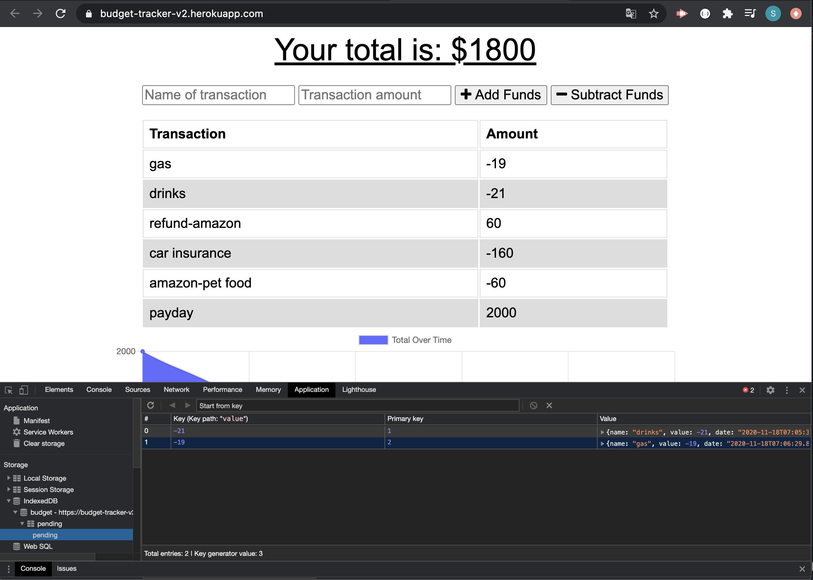
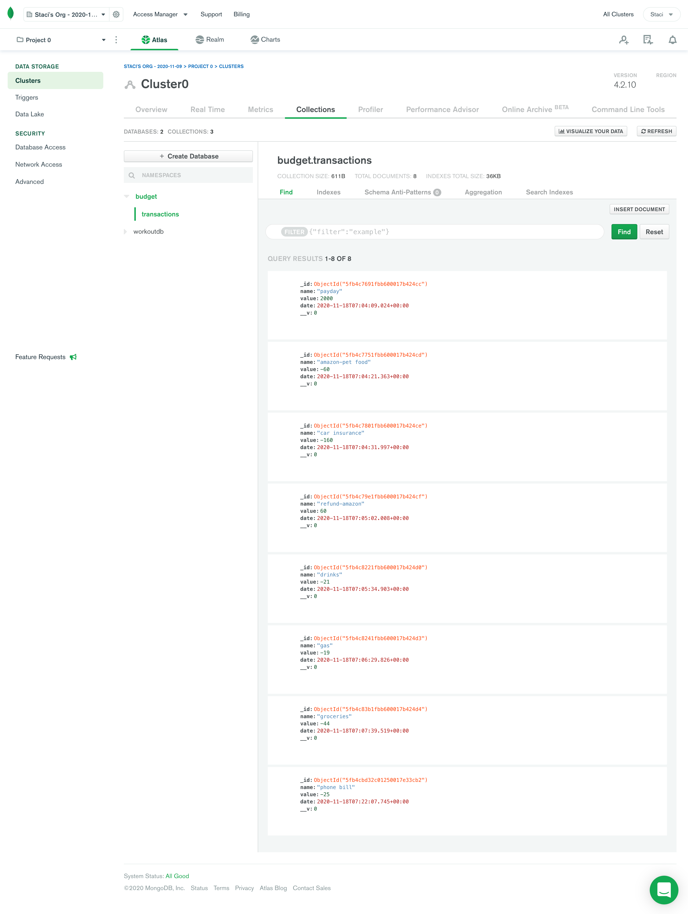
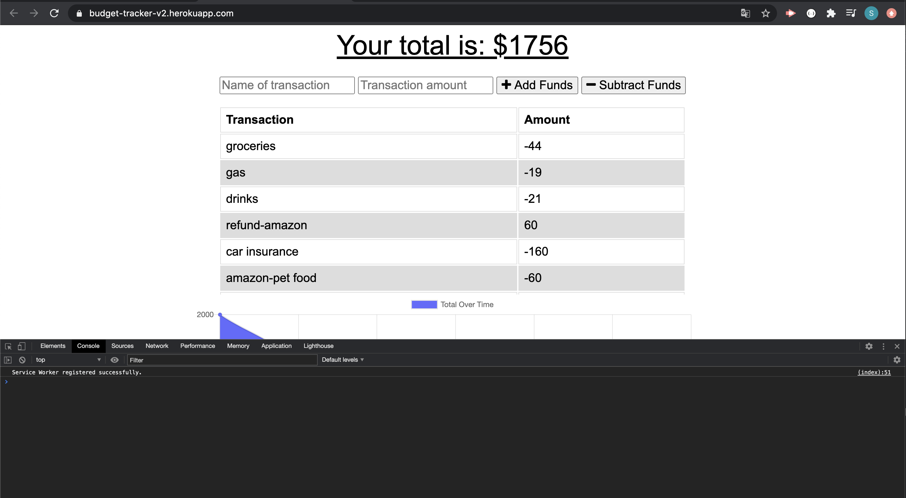

# Budget Tracker 2.0  

### Description
While travelling, keeping track of your expenses is important but accessible wifi can be limited. This upgraded budget tracker 2.0 allows you to keep track of your balance ON and OFFline, by caching the data you input-offline. Once you get online again, budget tracker will automatically send the cached data to the database,  helping you to keep your budget under control! Happy Traveling!

## Table of contents
* [Description](#Description)
* [Version](#Version)
* [Deployed Project](#Deployed)
* [Features](#Features)
* [Installation](#Installation)
* [Usage](#Usage)
* [Technologies](#Technologies)
* [Contributors](#Contributors)
* [Questions](#Questions)
* [License](#License)

### Version 
2.0.0

### Deployed Project
https://budget-tracker-v2.herokuapp.com/

### Features
* Node.js
* IndexedDB

* MongoDB Cloud Atlas

## Installation
go to the deployed link above or git clone the whole repo to run the app locally.

## Usage
    npm i 

to install all packages and initalize, then 

    npm start

### Additional Technologies
* Bootstrap
* npm libraries (compression, mongoose, morgan, express)
* Service Worker

## Contributors
s2hon

## Questions
Follow me on GitHub:  
Ask me anything: staci.shon@gmail.com  

## License
MIT © Staci Shon 